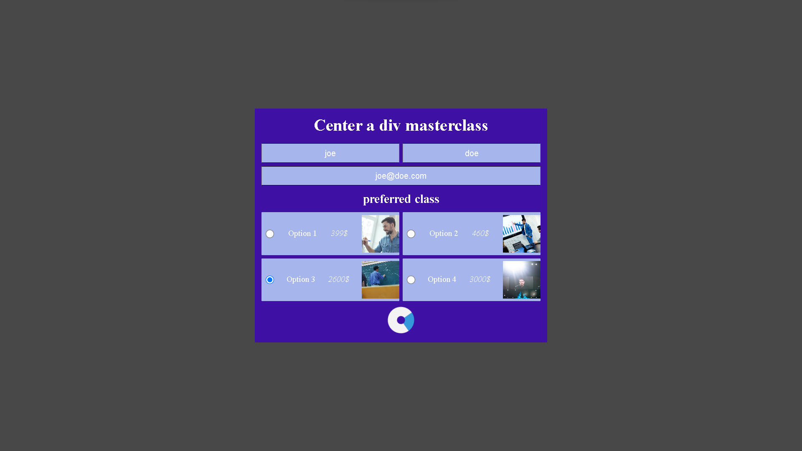

# Center a div masterclass

 

  
<h3 align="center">Center a div masterclass</h3>

## Brief Overview

To test out fetching data from an API and submitting form data, I created a simple HTML form and used a POST request to send the data to a mock API called JSONPlaceholder (https://jsonplaceholder.typicode.com/).
 
The form asks for basic information like name, email, and choice of class, and once submitted, the data is sent to the API using the fetch() method in JavaScript. The API then responds with a JSON object that includes the data submitted and redirects the user to a succes page.

 
Hosted live here: <a href="https://center.div.kutimo.dev/">kutimo.dev</a> 

 

### Built with

- [![JavaScript][javascript-shield]][js-url]
- [![HTML][html-shield]][html-url]
- [![CSS][css-shield]][css-url]

(<a href="#readme-top">back to top</a>)
  

[javascript-shield]: https://img.shields.io/badge/JavaScript-F0DB4F?style=for-the-badge&logo=JavaScript&logoColor=black
[js-url]: https://www.ecma-international.org/publications-and-standards/standards/ecma-262/
[html-shield]: https://img.shields.io/badge/HTML-e34c26?style=for-the-badge&logo=HTML5&logoColor=white
[html-url]: https://html.spec.whatwg.org/multipage/
[css-shield]: https://img.shields.io/badge/CSS-264de4?style=for-the-badge&logo=CSS3&logoColor=white
[css-url]: https://www.w3.org/Style/CSS/Overview.en.html
